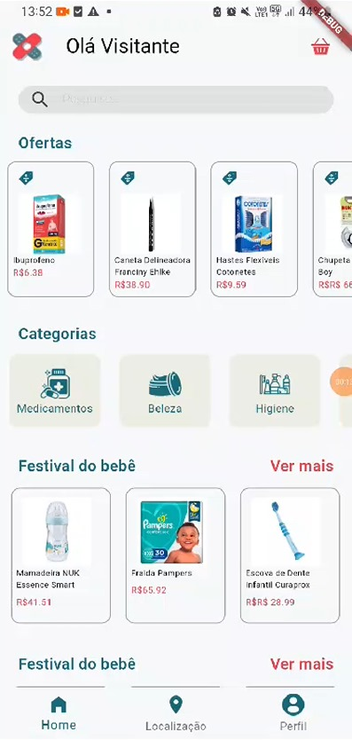
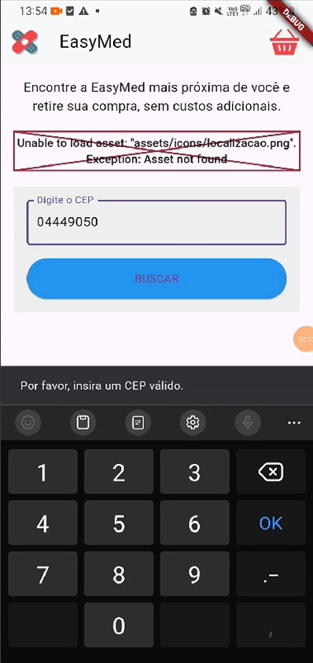
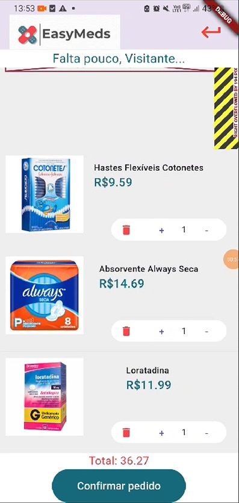

# EasyMeds: Solução Rápida e Inteligente para Farmácias

## 1. Título e Descrição

### Nome do Aplicativo

**EasyMeds**

### Resumo

O **EasyMeds** é um aplicativo desenvolvido para facilitar a organização e a retirada de medicamentos em farmácias, ajudando pessoas com rotinas agitadas, idosos e cuidadores a ganharem tempo e praticidade. Com ele, é possível criar listas de medicamentos e gerar uma nota prática para agilizar sua retirada.


### Problema Resolvido

Muitas pessoas enfrentam dificuldades ao organizar e gerenciar medicamentos, além de gastarem muito tempo em filas de farmácia. O **EasyMeds** resolve esse problema oferecendo uma plataforma eficiente e intuitiva, conectando os usuários às farmácias e permitindo um planejamento rápido e sem complicações.

---

## 2. Status do Projeto

**Status**: Em Desenvolvimento


---

## 3. Recursos

- **Gerenciamento de listas de produtos**: Criação de listas personalizadas com possibilidade de adicionar informações sobre os produtos(como dosagem e frequência).

  

- **Nota de pagamento**: Documento digital gerado automaticamente para agilizar o processo de retirada na farmácia.

  

- **Localização de farmácias próximas**: Localize farmácias participantes da EasyMeds em sua área utilizando geolocalização.

  

- **Histórico de compras**: Rastreie medicamentos adquiridos previamente e visualize a data das retiradas.

  

- **Notificações**: Receba lembretes push sobre retiradas ou quando for hora de adquirir um novo medicamento.

---

## 4. Pré-requisitos

- **Flutter** (versão 3.3 ou superior).
- **Dart** (versão 2.16 ou superior).
- Ferramentas de linha de comando do Flutter instaladas.
- **JSON**: Para estrutura de dados.
- **Sistema**: Windows, macOS ou Linux com suporte a Android Studio.

---

## 5. Instalação

1. Clone este repositório:

    ```bash
    git clone https://github.com/lluiscase/EasyMed.git
    ```

2. Navegue até a pasta do projeto:

    ```bash
    cd EasyMeds
    ```

3. Instale as dependências:

    ```bash
    flutter pub get
    ```

4. Execute o aplicativo:

    ```bash
    flutter run
    ```

5. Configure as variáveis de ambiente, se necessário (chaves de API para mapas, etc.).

---

## 6. Uso

- Ao abrir o aplicativo, crie um perfil e comece a adicionar medicamentos à sua lista.
- Gere a nota para retirada na farmácia mais próxima.
- Receba notificações para lembrar-se das retiradas.

---

## 7. Contribuição

Quer contribuir?

- Leia nosso [CONTRIBUTING.md](https://github.com/lluiscase/EasyMed/blob/main/CONTRIBUTING.md).
- Envie issues ou pull requests através do GitHub.
- Compartilhe feedback e ideias!

---

## 8. Licença

Este projeto está sob a licença **MIT**. Leia o arquivo [LICENSE.md](https://github.com/lluiscase/EasyMed/blob/main/LICENSE.md) para mais detalhes.

---

## 9. Contato

Dúvidas ou suporte:

- E-mail: [contato@easymeds.com](mailto:contato@easymeds.com)

---

## 10. Créditos

Desenvolvido por:

- Bruna Frinhani
- Kauã Santos
- Larissa Lobo
- Luis Andrade
- Mariana Laines
- Matheus de Sousa
- Tiago Rocha

Ferramentas utilizadas:

- **Figma**: Prototipagem.
- **Flutter e Dart**: Desenvolvimento.

---

## 11. Changelog

**Versão 0.1.0**: Primeira iteração do aplicativo com funcionalidades básicas implementadas.

---

## 12. Roadmap

- **Versão Beta**: Testes com usuários e coleta de feedback.
- **Integração com sistemas de farmácias**: Facilitando a comunicação direta com farmácias.
- **Recursos Premium**: Lembretes personalizados e relatórios de saúde.
- **Suporte Multiplataforma**: Web e desktop.

---

## 13. Testes

- Execute testes unitários com:

    ```bash
    flutter test
    ```

- Verifique a cobertura com:

    ```bash
    flutter test --coverage
    ```

---

## 14. FAQ

1. **O aplicativo é gratuito?**

    Sim, com opções de funcionalidades premium futuramente.

2. **Quais farmácias são compatíveis?**

    Inicialmente, as unidades parceiras da EasyMeds.

---

## 15. Links Úteis

- [Repositório GitHub](https://github.com/lluiscase/EasyMed)
- [Documentação Oficial Flutter](https://flutter.dev/docs)
- [Dart](https://dart.dev/)

